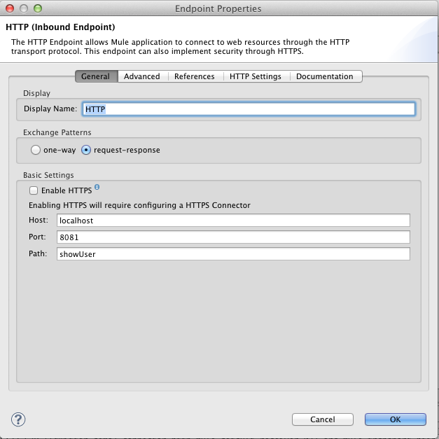
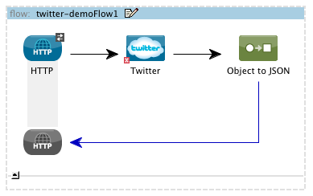
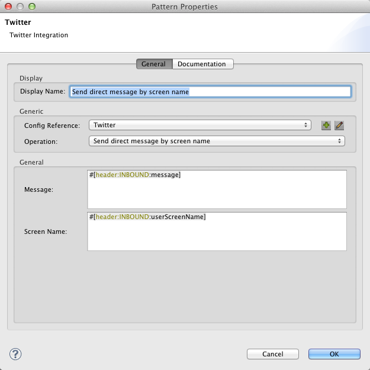

Purpose
=======

I'll be displaying how to meet the configuration requirements for using MuleSoft´s Twitter connector in a Mule project and how to use the most common operations.

Prerequisites
=============

In order to build and run this project you'll need:

●     Have a Twitter account.  
●     A retweet from a user you're following and a tweet with a mention.  
●     To download and install MuleStudio Community edition.  
●     Browser to make the requests and view the operations payloads.  

Initial setup of the Mule project
=================================

### Step: Get connector credentials

You will also need to enable your Twitter account for API access with write privileges. Please see [Configure Twitter for API Access](http://www.mulesoft.org/documentation/display/CLOUDHUB/Configure+Twitter+for+API+Access) for instructions on doing so.

### Step: Create a new Mule project

To begin building this application, start Mule Studio and create a new project:images

1      Select **File -\> New -\> Mule Project**  
2      In the New Mule Project configuration menu, provide a name for this project: **twitter-demo**  
3      Click **Next** and provide a name for the flow: **twitter-demo.**  
4      Click **Finish**.  

### Step: Store the credentials

In src/main/app/mule-app.properties file that's on your project put the following key/value pairs and replace what's displayed **bold** with your credentials values.

twitter.accessKey=**&lt;accessKeyFromTwitterDeveloperSite\>**
twitter.accessSecret=**&lt;accessSecretFromTwitterDeveloperSite\>**
twitter.consumerKey=**&lt;consumerKeyFromTwitterDeveloperSite\>**
twitter.consumerSecret=**&lt;consumerSecretFromTwitterDeveloperSite\>**  
> 

### Step: Create a Twitter Global element

1      Click on "Global Elements" tab at the bottom of the Flow editor window.  
2      Click on "Create" to bring up Global Type dialog box.  
3      Filter by "Twitter".  
4      Select "Twitter" from "Cloud Connectors" section.  
5      Populate the fields with property placeholders.  

    ${twitter.accessKey}  
    ${twitter.accessSecret}  
    ${twitter.consumerKey}  
    ${twitter.consumerSecret}  

6      Click Ok

First flow
==========

Let's create a small Mule flow that will return user information for the authenticated user.

### Step: Creating the Mule Flow

1      Drag and drop an HTTP Inbound Endpoint in the canvas.  
2      Double click the HTTP icon to bring up the properties dialog.  
3      Double click the flow element and set show-user in the Name field.  
4      Specify "showUser" in the Path field and click OK.

  
  

5      Drag and drop Twitter connector next to HTTP Inbound Endpoint.  
6      Double click on Twitter icon to bring up properties dialog.  
7      Set "Show user" as Display Name.  
8      Select Twitter from the Config Reference dropdown.  
9      Select "Show user" as Operation value and click OK.  

  

10   Finally drag and drop an "Object to JSON" transformer next to the "Twitter" connector.  

If you click the **Configuration XML** tab this is how the code should look like

    <?xml version="1.0" encoding="UTF-8"?\>
    <mule xmlns="http:/www.mulesoft.org/schema/mule/core" xmlns:json="http:/www.mulesoft.org/schema/mule/json" xmlns:http="http:/www.mulesoft.org/schema/mule/http" xmlns:twitter="http:/www.mulesoft.org/schema/mule/twitter" xmlns:doc="http:/www.mulesoft.org/schema/mule/documentation" xmlns:spring="http:/www.springframework.org/schema/beans" xmlns:xsi="http:/www.w3.org/2001/XMLSchema-instance" version="CE-3.3.0" xsi:schemaLocation="
    http:/www.mulesoft.org/schema/mule/json http:/www.mulesoft.org/schema/mule/json/current/mule-json.xsd
    http:/www.mulesoft.org/schema/mule/http http:/www.mulesoft.org/schema/mule/http/current/mule-http.xsd
    http:/www.mulesoft.org/schema/mule/twitter http:/www.mulesoft.org/schema/mule/twitter/2.4/mule-twitter.xsd
    http:/www.springframework.org/schema/beans http:/www.springframework.org/schema/beans/spring-beans-current.xsd
    http:/www.mulesoft.org/schema/mule/core http:/www.mulesoft.org/schema/mule/core/current/mule.xsd "\>

    <twitter:config name="Twitter" accessKey="${twitter.accessKey}" accessSecret="${twitter.accessSecret}" consumerKey="${twitter.consumerKey}" consumerSecret="${twitter.consumerSecret}" doc:name="Twitter"\>  

    <flow name="show-user" doc:name="show-user"\>
        <http:inbound-endpoint exchange-pattern="request-response" host="localhost" port="8081" path="showUser" doc:name="HTTP"\>
        <twitter:show-user config-ref="Twitter" doc:name="Show user"\>
        <json:object-to-json-transformer doc:name="Object to JSON"\>
        <flow\>
    <mule\>

### Step: Run the application

1      Right click on twitter-demo.mflow and select Run As Mule Application.  
2      Check the console to see when the application starts.

    ++++++++++++++++++++++++++++++++++++++++++++++++++++++++++++
 
    + Started app 'twitter-demo'                                  +

    ++++++++++++++++++++++++++++++++++++++++++++++++++++++++++++

3   Hit the endpoint at <http://localhost:8081/showUser> and check the operation payload formatted as JSON.

    {
   "id":729170916,
   "name":"MuleConnectorQA",
   "screenName":"MuleConnectorQA",
   "location":"",
   "description":"",
   "descriptionURLEntities":[

   ],
   "profileImageUrlHttps":"https://si0.twimg.com/sticky/default_profile_images/default_profile_5_normal.png",
   "url":null,
   "followersCount":0,
   "status":{
      "createdAt":1371653986000,
      "id":347368110849941505,
      "text":"ffd31563- Random Automation status",
      "source":"<a href=\"http://www.localhost.com\" rel=\"nofollow\">MuleQASandbox</a>",
      "inReplyToStatusId":-1,
      "inReplyToUserId":-1,
      "inReplyToScreenName":null,
      "geoLocation":null,
      "place":null,
      "retweetCount":1,
      "retweetedStatus":null,
      "userMentionEntities":[

      ],
      "hashtagEntities":[

      ],
      "mediaEntities":[

      ],
      "currentUserRetweetId":-1,
      "user":null,
      "contributors":[

      ],
      "urlentities":[

      ],
      "truncated":false,
      "favorited":false,
      "retweet":false,
      "retweetedByMe":false,
      "possiblySensitive":false,
      "rateLimitStatus":null,
      "accessLevel":0
   },
   "profileBackgroundColor":"C0DEED",
   "profileTextColor":"333333",
   "profileLinkColor":"0084B4",
   "profileSidebarFillColor":"DDEEF6",
   "profileSidebarBorderColor":"C0DEED",
   "profileUseBackgroundImage":true,
   "showAllInlineMedia":false,
   "friendsCount":1,
   "createdAt":1343766504000,
   "favouritesCount":0,
   "utcOffset":-10800,
   "timeZone":"Brasilia",
   "profileBackgroundImageUrl":"http://a0.twimg.com/images/themes/theme1/bg.png",
   "profileBackgroundImageUrlHttps":"https://si0.twimg.com/images/themes/theme1/bg.png",
   "profileBackgroundTiled":false,
   "lang":"en",
   "statusesCount":7,
   "translator":false,
   "listedCount":0,
   "protected":false,
   "geoEnabled":false,
   "contributorsEnabled":false,
   "profileImageURL":"http://a0.twimg.com/sticky/default_profile_images/default_profile_5_normal.png",
   "biggerProfileImageURL":"http://a0.twimg.com/sticky/default_profile_images/default_profile_5_bigger.png",
   "miniProfileImageURL":"http://a0.twimg.com/sticky/default_profile_images/default_profile_5_mini.png",
   "originalProfileImageURL":"http://a0.twimg.com/sticky/default_profile_images/default_profile_5.png",
   "profileImageURLHttps":"https://si0.twimg.com/sticky/default_profile_images/default_profile_5_normal.png",
   "biggerProfileImageURLHttps":"https://si0.twimg.com/sticky/default_profile_images/default_profile_5_bigger.png",
   "miniProfileImageURLHttps":"https://si0.twimg.com/sticky/default_profile_images/default_profile_5_mini.png",
   "originalProfileImageURLHttps":"https://si0.twimg.com/sticky/default_profile_images/default_profile_5.png",
   "profileBackgroundImageURL":"http://a0.twimg.com/images/themes/theme1/bg.png",
   "profileBannerURL":null,
   "profileBannerRetinaURL":null,
   "profileBannerIPadURL":null,
   "profileBannerIPadRetinaURL":null,
   "profileBannerMobileURL":null,
   "profileBannerMobileRetinaURL":null,
   "verified":false,
   "followRequestSent":false,
   "urlentity":{
      "start":0,
      "end":0,
      "url":"",
      "expandedURL":"",
      "displayURL":""
   },
   "rateLimitStatus":{
      "remaining":179,
      "limit":180,
      "resetTimeInSeconds":1372087839,
      "secondsUntilReset":899,
      "remainingHits":179
   },
   "accessLevel":3
}

From this response we're going to save the id and screenName of the authenticated user for later use.

Tweeting and sending direct messages
====================================

This next set of operations is related to statuses and direct messages. We're going to be using the user id and screen name we obtained from the Show user response before.

The creation of the flow for each of the next three operations is the same the one described in the First flow section:

1      Drag and drop an HTTP Inbound Endpoint in the canvas and specify "operationName" in the Path field.  
2      Double click the flow element and set "operationName" in the Name field.  
3      Drag and drop Twitter connector next to HTTP Inbound Endpoint.  
4      Finally drag and drop an "Object to JSON" transformer next to the "Twitter" connector.

Some customization depending on the operation and its input values will have to be performed. Let's go over each individually.

Update status
-------------

1      Double click on Twitter icon to bring up properties dialog.  
2      Set "Update status" as Display Name.  
3      Select Twitter from the Config Reference dropdown.  
4      Select "Update status" as Operation value.  
5      In the Status field enter "This is a twitter status" and click OK.  

Send direct message by screen name
----------------------------------

1      Double click on Twitter icon to bring up properties dialog.  
2      Set "Send direct message by screen name" as Display Name.  
3      Select Twitter from the Config Reference dropdown.  
4      Select "Send direct message by screen name" as Operation value.  
5      In the Message field enter "\#[header:INBOUND:message]", this expression extracts the "message" parameter value from HTTP request.  
6      The same goes for the Screen Name field, enter "\#[header:INBOUND:screenName]" and click OK.  

  

### Step: Run the application

1      Right click on twitter-demo.mflow and select Run As Mule Application.  
2      Check the console to see when the application starts.  

    ++++++++++++++++++++++++++++++++++++++++++++++++++++++++++++

    + Started app 'twitter-demo'                                  +

    ++++++++++++++++++++++++++++++++++++++++++++++++++++++++++++

3      Hit the endpoint at
 <http://localhost:8081/updateStatus>.
 Check the text field of the JSON object returned as payload.

{
   "id":729170916,
   "name":"MuleConnectorQA",
   "screenName":"MuleConnectorQA",
   "location":"",
   "description":"",
   "descriptionURLEntities":[

   ],
   "profileImageUrlHttps":"https://si0.twimg.com/sticky/default_profile_images/default_profile_5_normal.png",
   "url":null,
   "followersCount":0,
   "status":{
      "createdAt":1371653986000,
      "id":347368110849941505,
      "text":"This is a twitter statuses",
      "source":"<a href=\"http://www.localhost.com\" rel=\"nofollow\">MuleQASandbox</a>",
      "inReplyToStatusId":-1,
      "inReplyToUserId":-1,
      "inReplyToScreenName":null,
      "geoLocation":null,
      "place":null,
      "retweetCount":1,
      "retweetedStatus":null,
      "userMentionEntities":[

      ],
      "hashtagEntities":[

      ],
      "mediaEntities":[

      ],
      "currentUserRetweetId":-1,
      "user":null,
      "contributors":[

      ],
      "urlentities":[

      ],
      "truncated":false,
      "favorited":false,
      "retweet":false,
      "retweetedByMe":false,
      "possiblySensitive":false,
      "rateLimitStatus":null,
      "accessLevel":0
   },
   "profileBackgroundColor":"C0DEED",
   "profileTextColor":"333333",
   "profileLinkColor":"0084B4",
   "profileSidebarFillColor":"DDEEF6",
   "profileSidebarBorderColor":"C0DEED",
   "profileUseBackgroundImage":true,
   "showAllInlineMedia":false,
   "friendsCount":1,
   "createdAt":1343766504000,
   "favouritesCount":0,
   "utcOffset":-10800,
   "timeZone":"Brasilia",
   "profileBackgroundImageUrl":"http://a0.twimg.com/images/themes/theme1/bg.png",
   "profileBackgroundImageUrlHttps":"https://si0.twimg.com/images/themes/theme1/bg.png",
   "profileBackgroundTiled":false,
   "lang":"en",
   "statusesCount":7,
   "translator":false,
   "listedCount":0,
   "protected":false,
   "geoEnabled":false,
   "contributorsEnabled":false,
   "profileImageURL":"http://a0.twimg.com/sticky/default_profile_images/default_profile_5_normal.png",
   "biggerProfileImageURL":"http://a0.twimg.com/sticky/default_profile_images/default_profile_5_bigger.png",
   "miniProfileImageURL":"http://a0.twimg.com/sticky/default_profile_images/default_profile_5_mini.png",
   "originalProfileImageURL":"http://a0.twimg.com/sticky/default_profile_images/default_profile_5.png",
   "profileImageURLHttps":"https://si0.twimg.com/sticky/default_profile_images/default_profile_5_normal.png",
   "biggerProfileImageURLHttps":"https://si0.twimg.com/sticky/default_profile_images/default_profile_5_bigger.png",
   "miniProfileImageURLHttps":"https://si0.twimg.com/sticky/default_profile_images/default_profile_5_mini.png",
   "originalProfileImageURLHttps":"https://si0.twimg.com/sticky/default_profile_images/default_profile_5.png",
   "profileBackgroundImageURL":"http://a0.twimg.com/images/themes/theme1/bg.png",
   "profileBannerURL":null,
   "profileBannerRetinaURL":null,
   "profileBannerIPadURL":null,
   "profileBannerIPadRetinaURL":null,
   "profileBannerMobileURL":null,
   "profileBannerMobileRetinaURL":null,
   "verified":false,
   "followRequestSent":false,
   "urlentity":{
      "start":0,
      "end":0,
      "url":"",
      "expandedURL":"",
      "displayURL":""
   },
   "rateLimitStatus":{
      "remaining":179,
      "limit":180,
      "resetTimeInSeconds":1372087839,
      "secondsUntilReset":899,
      "remainingHits":179
   },
   "accessLevel":3
}

Also if you go to your Twitter homepage a new tweet appears containing the text you tweeted through the connector.

4      Replace the message and the userScreenName values in this URL
  <http://localhost:8081/sendDirectMessageByScreenName?message=&lt;directMessageByScreenName\>&userScreenName=&lt;userScreenName\>>
 and hit the endpoint. This operations Sends a new direct message to the specified user from the authenticating user. Pay attention to the sender, receiver and message fields of the response.

    {
   "id":349214462424805376,
   "text":"newDirectMessage",
   "senderId":729170916,
   "recipientId":729170916,
   "createdAt":1372094190000,
   "senderScreenName":"MuleConnectorQA",
   "recipientScreenName":"MuleConnectorQA",
   "userMentionEntities":[

   ],
   "hashtagEntities":[

   ],
   "mediaEntities":[

   ],
   "sender":{
      "id":729170916,
      "name":"MuleConnectorQA",
      "screenName":"MuleConnectorQA",
      "location":null,
      "description":null,
      "descriptionURLEntities":[

      ],
      "profileImageUrlHttps":"https://twimg0-a.akamaihd.net/sticky/default_profile_images/default_profile_5_normal.png",
      "url":null,
      "followersCount":0,
      "status":null,
      "profileBackgroundColor":"C0DEED",
      "profileTextColor":"333333",
      "profileLinkColor":"0084B4",
      "profileSidebarFillColor":"DDEEF6",
      "profileSidebarBorderColor":"C0DEED",
      "profileUseBackgroundImage":true,
      "showAllInlineMedia":false,
      "friendsCount":1,
      "createdAt":1343766504000,
      "favouritesCount":0,
      "utcOffset":-10800,
      "timeZone":"Brasilia",
      "profileBackgroundImageUrl":"http://a0.twimg.com/images/themes/theme1/bg.png",
      "profileBackgroundImageUrlHttps":"https://twimg0-a.akamaihd.net/images/themes/theme1/bg.png",
      "profileBackgroundTiled":false,
      "lang":"en",
      "statusesCount":7,
      "translator":false,
      "listedCount":0,
      "protected":false,
      "geoEnabled":false,
      "contributorsEnabled":false,
      "profileImageURL":"http://a0.twimg.com/sticky/default_profile_images/default_profile_5_normal.png",
      "biggerProfileImageURL":"http://a0.twimg.com/sticky/default_profile_images/default_profile_5_bigger.png",
      "miniProfileImageURL":"http://a0.twimg.com/sticky/default_profile_images/default_profile_5_mini.png",
      "originalProfileImageURL":"http://a0.twimg.com/sticky/default_profile_images/default_profile_5.png",
      "profileImageURLHttps":"https://twimg0-a.akamaihd.net/sticky/default_profile_images/default_profile_5_normal.png",
      "biggerProfileImageURLHttps":"https://twimg0-a.akamaihd.net/sticky/default_profile_images/default_profile_5_bigger.png",
      "miniProfileImageURLHttps":"https://twimg0-a.akamaihd.net/sticky/default_profile_images/default_profile_5_mini.png",
      "originalProfileImageURLHttps":"https://twimg0-a.akamaihd.net/sticky/default_profile_images/default_profile_5.png",
      "profileBackgroundImageURL":"http://a0.twimg.com/images/themes/theme1/bg.png",
      "profileBannerURL":null,
      "profileBannerRetinaURL":null,
      "profileBannerIPadURL":null,
      "profileBannerIPadRetinaURL":null,
      "profileBannerMobileURL":null,
      "profileBannerMobileRetinaURL":null,
      "verified":false,
      "followRequestSent":false,
      "urlentity":{
         "start":0,
         "end":0,
         "url":"",
         "expandedURL":"",
         "displayURL":""
      },
      "rateLimitStatus":null,
      "accessLevel":0
   },
   "recipient":{
      "id":729170916,
      "name":"MuleConnectorQA",
      "screenName":"MuleConnectorQA",
      "location":null,
      "description":null,
      "descriptionURLEntities":[

      ],
      "profileImageUrlHttps":"https://twimg0-a.akamaihd.net/sticky/default_profile_images/default_profile_5_normal.png",
      "url":null,
      "followersCount":0,
      "status":null,
      "profileBackgroundColor":"C0DEED",
      "profileTextColor":"333333",
      "profileLinkColor":"0084B4",
      "profileSidebarFillColor":"DDEEF6",
      "profileSidebarBorderColor":"C0DEED",
      "profileUseBackgroundImage":true,
      "showAllInlineMedia":false,
      "friendsCount":1,
      "createdAt":1343766504000,
      "favouritesCount":0,
      "utcOffset":-10800,
      "timeZone":"Brasilia",
      "profileBackgroundImageUrl":"http://a0.twimg.com/images/themes/theme1/bg.png",
      "profileBackgroundImageUrlHttps":"https://twimg0-a.akamaihd.net/images/themes/theme1/bg.png",
      "profileBackgroundTiled":false,
      "lang":"en",
      "statusesCount":7,
      "translator":false,
      "listedCount":0,
      "protected":false,
      "geoEnabled":false,
      "contributorsEnabled":false,
      "profileImageURL":"http://a0.twimg.com/sticky/default_profile_images/default_profile_5_normal.png",
      "biggerProfileImageURL":"http://a0.twimg.com/sticky/default_profile_images/default_profile_5_bigger.png",
      "miniProfileImageURL":"http://a0.twimg.com/sticky/default_profile_images/default_profile_5_mini.png",
      "originalProfileImageURL":"http://a0.twimg.com/sticky/default_profile_images/default_profile_5.png",
      "profileImageURLHttps":"https://twimg0-a.akamaihd.net/sticky/default_profile_images/default_profile_5_normal.png",
      "biggerProfileImageURLHttps":"https://twimg0-a.akamaihd.net/sticky/default_profile_images/default_profile_5_bigger.png",
      "miniProfileImageURLHttps":"https://twimg0-a.akamaihd.net/sticky/default_profile_images/default_profile_5_mini.png",
      "originalProfileImageURLHttps":"https://twimg0-a.akamaihd.net/sticky/default_profile_images/default_profile_5.png",
      "profileBackgroundImageURL":"http://a0.twimg.com/images/themes/theme1/bg.png",
      "profileBannerURL":null,
      "profileBannerRetinaURL":null,
      "profileBannerIPadURL":null,
      "profileBannerIPadRetinaURL":null,
      "profileBannerMobileURL":null,
      "profileBannerMobileRetinaURL":null,
      "verified":false,
      "followRequestSent":false,
      "urlentity":{
         "start":0,
         "end":0,
         "url":"",
         "expandedURL":"",
         "displayURL":""
      },
      "rateLimitStatus":null,
      "accessLevel":0
   },
   "urlentities":[

   ],
   "rateLimitStatus":null,
   "accessLevel":3
}

 If you go to your Twitter homepage and check your Direct Messages it can be found among them.

Getting timelines
==============================

Like in the previous section we're going to be using the same flow pattern but for timeline and mentions related operations.

Get user timeline by user id
----------------------------

1      Double click on Twitter icon to bring up properties dialog.  
2      Set "Get user timeline by user id" as Display Name.  
3      Select Twitter from the Config Reference dropdown.  
4      Select "Get user timeline by user id" as Operation value.  
5      In the User Id field, enter "\#[header:INBOUND:userId]" and click OK.  

### Step: Run the application

1      Right click on twitter-demo.mflow and select Run As Mule Application.

2      Check the console to see when the application starts.

    ++++++++++++++++++++++++++++++++++++++++++++++++++++++++++++

    + Started app 'twitter-demo'                                  +

    ++++++++++++++++++++++++++++++++++++++++++++++++++++++++++++

3      Replace the message and the userId value in this URL
 <http://localhost:8081/getUserTimelineByUserId?userId=&lt;userId\>>
 and hit the endpoint.

    [
    {
      "createdAt":1361340860000,
      "id":304111727988076545,
      "text":"firstStatusToRetweetText",
      "source":"<a href=\"http://www.localhost.com\" rel=\"nofollow\">MuleQASandbox</a>",
      "inReplyToStatusId":-1,
      "inReplyToUserId":-1,
      "inReplyToScreenName":null,
      "geoLocation":null,
      "place":null,
      "retweetCount":0,
      "retweetedStatus":null,
      "userMentionEntities":[

      ],
      "hashtagEntities":[

      ],
      "mediaEntities":[

      ],
      "currentUserRetweetId":-1,
      "user":{
         "id":729170916,
         "name":"MuleConnectorQA",
         "screenName":"MuleConnectorQA",
         "location":"",
         "description":"",
         "descriptionURLEntities":[

         ],
         "profileImageUrlHttps":"https://si0.twimg.com/sticky/default_profile_images/default_profile_5_normal.png",
         "url":null,
         "followersCount":0,
         "status":null,
         "profileBackgroundColor":"C0DEED",
         "profileTextColor":"333333",
         "profileLinkColor":"0084B4",
         "profileSidebarFillColor":"DDEEF6",
         "profileSidebarBorderColor":"C0DEED",
         "profileUseBackgroundImage":true,
         "showAllInlineMedia":false,
         "friendsCount":1,
         "createdAt":1343766504000,
         "favouritesCount":0,
         "utcOffset":-10800,
         "timeZone":"Brasilia",
         "profileBackgroundImageUrl":"http://a0.twimg.com/images/themes/theme1/bg.png",
         "profileBackgroundImageUrlHttps":"https://si0.twimg.com/images/themes/theme1/bg.png",
         "profileBackgroundTiled":false,
         "lang":"en",
         "statusesCount":7,
         "translator":false,
         "listedCount":0,
         "protected":false,
         "geoEnabled":false,
         "contributorsEnabled":false,
         "profileImageURL":"http://a0.twimg.com/sticky/default_profile_images/default_profile_5_normal.png",
         "biggerProfileImageURL":"http://a0.twimg.com/sticky/default_profile_images/default_profile_5_bigger.png",
         "miniProfileImageURL":"http://a0.twimg.com/sticky/default_profile_images/default_profile_5_mini.png",
         "originalProfileImageURL":"http://a0.twimg.com/sticky/default_profile_images/default_profile_5.png",
         "profileImageURLHttps":"https://si0.twimg.com/sticky/default_profile_images/default_profile_5_normal.png",
         "biggerProfileImageURLHttps":"https://si0.twimg.com/sticky/default_profile_images/default_profile_5_bigger.png",
         "miniProfileImageURLHttps":"https://si0.twimg.com/sticky/default_profile_images/default_profile_5_mini.png",
         "originalProfileImageURLHttps":"https://si0.twimg.com/sticky/default_profile_images/default_profile_5.png",
         "profileBackgroundImageURL":"http://a0.twimg.com/images/themes/theme1/bg.png",
         "profileBannerURL":null,
         "profileBannerRetinaURL":null,
         "profileBannerIPadURL":null,
         "profileBannerIPadRetinaURL":null,
         "profileBannerMobileURL":null,
         "profileBannerMobileRetinaURL":null,
         "verified":false,
         "followRequestSent":false,
         "urlentity":{
            "start":0,
            "end":0,
            "url":"",
            "expandedURL":"",
            "displayURL":""
         },
         "rateLimitStatus":null,
         "accessLevel":0
      },
      "contributors":[

      ],
      "urlentities":[

      ],
      "truncated":false,
      "favorited":false,
      "retweet":false,
      "retweetedByMe":false,
      "possiblySensitive":false,
      "rateLimitStatus":null,
      "accessLevel":0
   },
    {
      "createdAt":1356116199000,
      "id":282197912048500736,
      "text":"This is a twitter status",
      "source":"<a href=\"http://www.localhost.com\" rel=\"nofollow\">MuleQASandbox</a>",
      "inReplyToStatusId":-1,
      "inReplyToUserId":-1,
      "inReplyToScreenName":null,
      "geoLocation":null,
      "place":null,
      "retweetCount":0,
      "retweetedStatus":null,
      "userMentionEntities":[

      ],
      "hashtagEntities":[

      ],
      "mediaEntities":[

      ],
      "currentUserRetweetId":-1,
      "user":{
         "id":729170916,
         "name":"MuleConnectorQA",
         "screenName":"MuleConnectorQA",
         "location":"",
         "description":"",
         "descriptionURLEntities":[

         ],
         "profileImageUrlHttps":"https://si0.twimg.com/sticky/default_profile_images/default_profile_5_normal.png",
         "url":null,
         "followersCount":0,
         "status":null,
         "profileBackgroundColor":"C0DEED",
         "profileTextColor":"333333",
         "profileLinkColor":"0084B4",
         "profileSidebarFillColor":"DDEEF6",
         "profileSidebarBorderColor":"C0DEED",
         "profileUseBackgroundImage":true,
         "showAllInlineMedia":false,
         "friendsCount":1,
         "createdAt":1343766504000,
         "favouritesCount":0,
         "utcOffset":-10800,
         "timeZone":"Brasilia",
         "profileBackgroundImageUrl":"http://a0.twimg.com/images/themes/theme1/bg.png",
         "profileBackgroundImageUrlHttps":"https://si0.twimg.com/images/themes/theme1/bg.png",
         "profileBackgroundTiled":false,
         "lang":"en",
         "statusesCount":7,
         "translator":false,
         "listedCount":0,
         "protected":false,
         "geoEnabled":false,
         "contributorsEnabled":false,
         "profileImageURL":"http://a0.twimg.com/sticky/default_profile_images/default_profile_5_normal.png",
         "biggerProfileImageURL":"http://a0.twimg.com/sticky/default_profile_images/default_profile_5_bigger.png",
         "miniProfileImageURL":"http://a0.twimg.com/sticky/default_profile_images/default_profile_5_mini.png",
         "originalProfileImageURL":"http://a0.twimg.com/sticky/default_profile_images/default_profile_5.png",
         "profileImageURLHttps":"https://si0.twimg.com/sticky/default_profile_images/default_profile_5_normal.png",
         "biggerProfileImageURLHttps":"https://si0.twimg.com/sticky/default_profile_images/default_profile_5_bigger.png",
         "miniProfileImageURLHttps":"https://si0.twimg.com/sticky/default_profile_images/default_profile_5_mini.png",
         "originalProfileImageURLHttps":"https://si0.twimg.com/sticky/default_profile_images/default_profile_5.png",
         "profileBackgroundImageURL":"http://a0.twimg.com/images/themes/theme1/bg.png",
         "profileBannerURL":null,
         "profileBannerRetinaURL":null,
         "profileBannerIPadURL":null,
         "profileBannerIPadRetinaURL":null,
         "profileBannerMobileURL":null,
         "profileBannerMobileRetinaURL":null,
         "verified":false,
         "followRequestSent":false,
         "urlentity":{
            "start":0,
            "end":0,
            "url":"",
            "expandedURL":"",
            "displayURL":""
         },
         "rateLimitStatus":null,
         "accessLevel":0
      },
      "contributors":[

      ],
      "urlentities":[

      ],
      "truncated":false,
      "favorited":false,
      "retweet":false,
      "retweetedByMe":false,
      "possiblySensitive":false,
      "rateLimitStatus":null,
      "accessLevel":0
   }
]

The response is the same as the one we would get from from **Get user timeline** and **Get user timeline by user screen name**.

Resources
=========

For additional information related to the Twitter Connector you can check the [API docs](http://mulesoft.github.com/twitter-connector/mule/twitter-config.html) that are available in [MuleSoft's Twitter Connector Github repository.](http://www.google.com/url?q=https%3A%2F%2Fgithub.com%2Fmulesoft%2Ftwitter-connector&sa=D&sntz=1&usg=AFQjCNGHEHGpAZNCG2bNeHyIk68zIqBvLg)

You can also check the Mule School entries in the [MuleSoft Blog](http://blogs.mulesoft.org/).

   

Webinars and additional documentation related to Mule ESB can be found under [Resources](http://www.mulesoft.com/resources) menu option.

